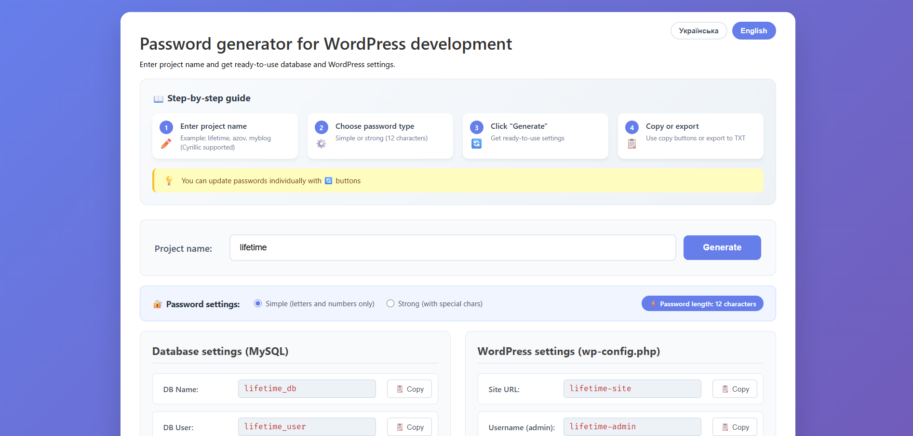
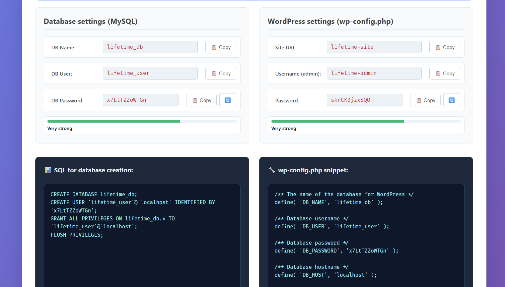
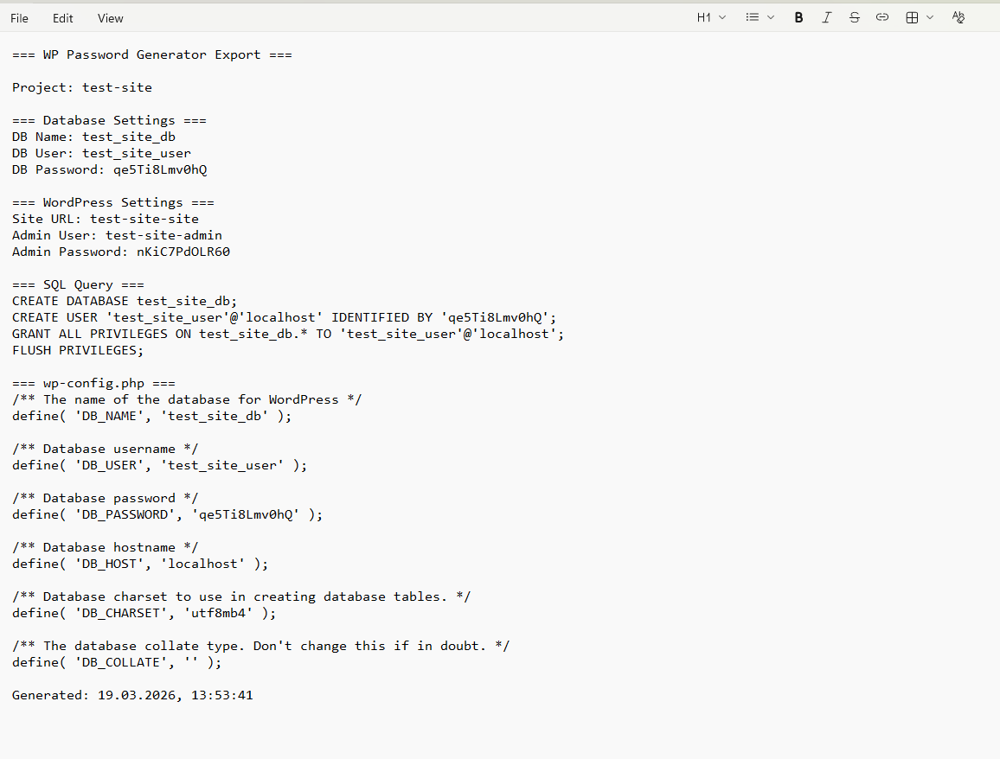

# 🔐 WP Password Generator

<div align="center">
  
  ### Password and Settings Generator for WordPress Developers
  
  [](https://opensource.org/licenses/MIT)
  [](http://makeapullrequest.com)
  
  
  
  
  
</div>

---

## 📋 About The Project

**WP Password Generator** is a free web tool created to simplify the workflow of WordPress developers. It automatically generates unique database names, usernames, and secure passwords when migrating sites to a new hosting.

### 🎯 The Problem It Solves

Every developer faces the need to:
- Come up with unique database names
- Create database usernames
- Generate secure passwords
- Update wp-config.php

Our generator does this in seconds!

---

## ✨ Features

### 🔑 Generated Data
| Component | Format | Example |
|-----------|--------|---------|
| Database Name | `{project}_db` | `lifetime_db` |
| Database User | `{project}_user` | `lifetime_user` |
| Database Password | 12 characters | `k8J#mP2$nL5x` |
| Site Name | `{project}-site` | `lifetime-site` |
| WordPress User | `{project}-admin` | `lifetime-admin` |
| WordPress Password | 12 characters | `xR7@qW3!eK9p` |

### 🛠 Functionality

✅ **Two Password Types**
- Simple (letters and numbers only)
- Strong (with special characters)

✅ **Transliteration** – support for Ukrainian project names

✅ **Strength Indicator** – visual representation of password security

✅ **Ready-to-Use Code Snippets**
- SQL for database creation
- Section for wp-config.php

✅ **TXT Export** – save all data to a text file

✅ **Usage Statistics** – track the number of generated passwords

✅ **Bilingual Interface** – Ukrainian and English languages

✅ **Step-by-Step Guide** – for beginners

✅ **Responsive Design** – displays correctly on all devices

---

## 🚀 Demo

**[View Demo](#)** – *insert GitHub Pages link*

### Screenshots

<div align="center">
  
  <p><em>Main screen of the generator</em></p>
  
  
  <p><em>Generation example for "lifetime" project</em></p>
  
  
  <p><em>Exporting results to TXT</em></p>
</div>

---

## 💻 How to Use

### Online Version
1. Go to [wp-password-generator](#)
2. Enter the project name (e.g., "lifetime", "azov", "myblog")
3. Choose password type (simple or strong)
4. Click "Generate"
5. Copy SQL or wp-config.php snippet
6. Export data to TXT if needed

### Local Usage
```bash
# Clone the repository
git clone https://github.com/yourusername/wp-password-generator.git

# Navigate to directory
cd wp-password-generator

# Open index.html in browser
open index.html  # for macOS
# or
start index.html # for Windows
# or
xdg-open index.html # for Linux

https://ovcharovcoder.github.io/wp-password-generator/
