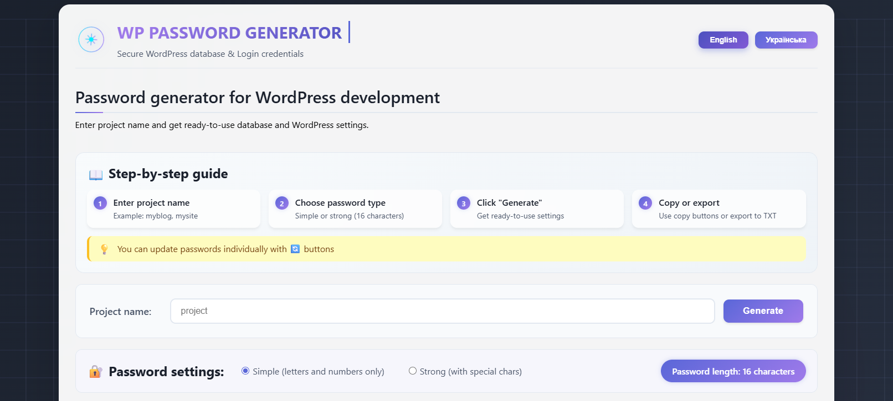
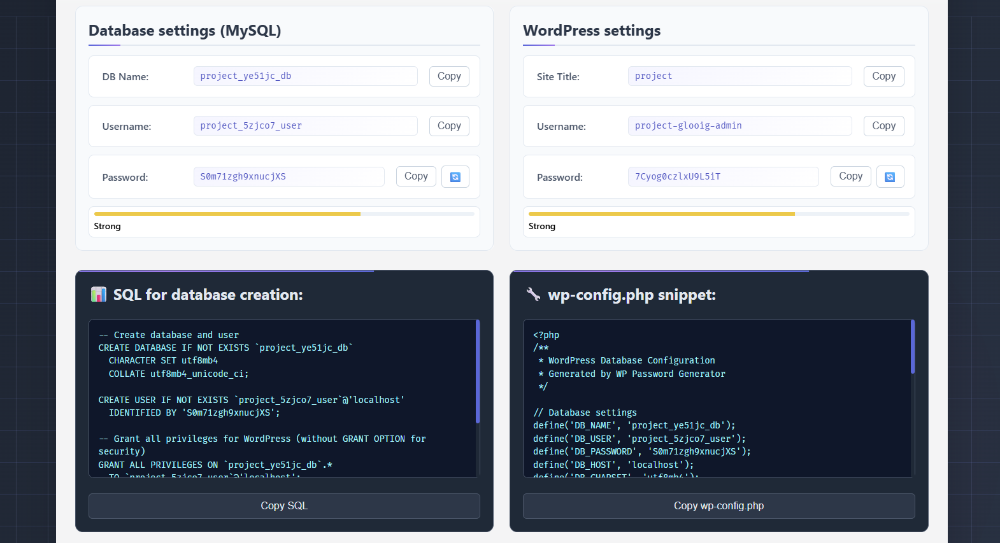
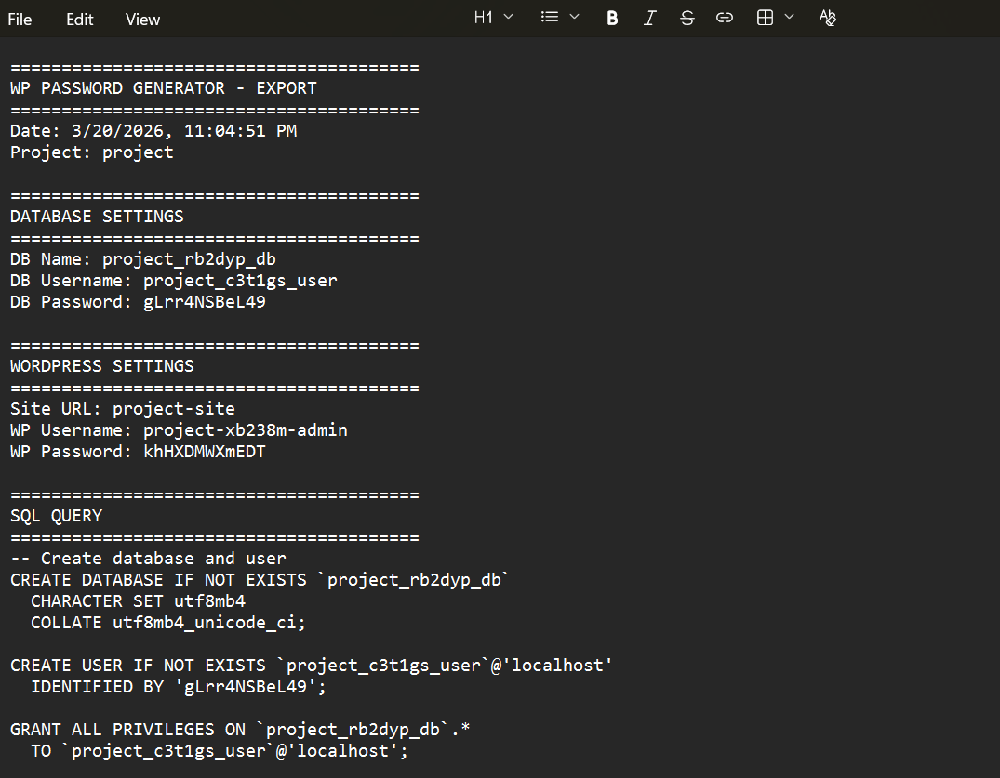

# 🔐 WP Password Generator

  
  ### Advanced password and security configuration generator for WordPress developers
  
  
  
  
  
  
  
  

---

## 📋 About the project

**WP Password Generator** is a free, open-source web tool that helps WordPress developers quickly generate secure database credentials, WordPress configuration files, and security-hardened `.htaccess` and `robots.txt` files.

### 🎯 The problem it solves

Every developer faces the need to:
- Create unique database names and users
- Generate cryptographically secure passwords
- Configure `wp-config.php` with proper security keys
- Set up `.htaccess` for security and performance
- Create SEO-optimized `robots.txt`
- Ensure all credentials are unique and secure

**Our generator does all this in seconds!** 🚀

---

## ⚡ **Time Savings**

| Task | Without Generator | With Generator | Time Saved |
|------|------------------|----------------|------------|
| Database & User Creation | 3-5 min | 10 sec | **~95%** |
| wp-config.php Setup | 2-3 min | 5 sec | **~95%** |
| Security Keys Generation | 1-2 min | 1 sec | **~98%** |
| .htaccess Configuration | 10-15 min | 5 sec | **~95%** |
| robots.txt Setup | 3-5 min | 5 sec | **~90%** |
| **Total** | **20-30 min** | **< 1 min** | **~95%** |

---

## ✨ Features

### 🔐 **Cryptographic Security**
- Uses `crypto.getRandomValues()` – bank-grade random number generation
- 16-character passwords with guaranteed character diversity
- Unique 6-character suffixes for each component (database, DB user, WP admin)
- 64-character Security Keys for WordPress

### 🗄️ **Generated Components**

| Component | Format | Example |
|-----------|--------|---------|
| Database Name | `{project}_{suffix}_db` | `project_6dw32r_db` |
| Database User | `{project}_{suffix}_user` | `project_y02moy_user` |
| Database Password | 16 characters with special chars | `k8J#mP2$nL5x!9Q` |
| Site Title | `{project}` | `lactazic` |
| WordPress Admin | `{project}-{suffix}-admin` | `lactazic-1bf9mz-admin` |
| WordPress Password | 16 characters | `xR7@qW3!eK9p$mN2` |

### 🛡️ **Security Files Generated**

| File | Protection Level | Description |
|------|------------------|-------------|
| **SQL** | High | Complete database creation with secure user privileges |
| **wp-config.php** | High | Database credentials + 8 unique Security Keys |
| **.htaccess** | High | Protection against directory browsing, XML-RPC, SQL injection, sensitive file access, Gzip compression, caching, security headers |
| **robots.txt** | Medium | SEO optimization with sensitive directory blocking |

### 🛠 **Functionality**

✅ **Two password types**
- Simple (letters and numbers only)
- Strong (with special characters: `!@#$%^*_+-=`)

✅ **Transliteration** – support for Ukrainian and Cyrillic project names

✅ **Strength indicator** – visual feedback on password security level

✅ **Unique suffixes** – each component gets its own random 6-character suffix

✅ **Ready-to-Use code snippets**
- SQL for database creation (with proper permissions)
- wp-config.php (with all 8 Security Keys)
- .htaccess (Apache security rules)
- robots.txt (SEO-optimized)

✅ **TXT export** – save all configuration data to a single text file

✅ **Bilingual interface** – Ukrainian and English languages

✅ **Step-by-Step guide** – intuitive instructions for beginners

✅ **Responsive design** – works perfectly on all devices

✅ **Copy to clipboard** – fallback support for all browsers

---

## 🔒 **Security Features**

| Feature | Description |
|---------|-------------|
| **Cryptographic RNG** | `crypto.getRandomValues()` – impossible to predict |
| **Unique Suffixes** | 6 random chars per component (36^6 combinations) |
| **Password Strength** | Minimum 16 chars, all character types included |
| **SQL Injection Protection** | Full MySQL escaping for passwords |
| **.htaccess Rules** | Blocks XML-RPC, directory browsing, hidden files, sensitive extensions |
| **Security Headers** | X-Frame-Options, CSP, Referrer-Policy |
| **WordPress Security Keys** | 8 unique 64-char salts generated per project |

---

## 🏆 **Why Choose This Generator?**

| Aspect | Rating | Why |
|--------|--------|-----|
| **Design & UX** | ⭐⭐⭐⭐⭐ | Modern, futuristic, intuitive interface with step-by-step guide |
| **Security** | ⭐⭐⭐⭐⭐ | Bank-grade cryptography, unique suffixes, SQL injection protection |
| **Functionality** | ⭐⭐⭐⭐⭐ | 4 essential files (SQL, wp-config, .htaccess, robots.txt) |
| **Time Savings** | ⭐⭐⭐⭐⭐ | Saves up to 95% of manual configuration time |
| **Localization** | ⭐⭐⭐⭐⭐ | Full Ukrainian & English support with Cyrillic transliteration |
| **Accessibility** | ⭐⭐⭐⭐⭐ | Works on all devices, fallback support for older browsers |

---

## 📸 Screenshots

  
  
<em>Main screen with modern futuristic design</em>

  
  
  
<em>Generated credentials for "project" project</em>

  
  
  
<em>Complete TXT export with all configuration files</em>

---

## 💻 How to use

### Online version
1. Go to [WP Password Generator](https://ovcharovcoder.github.io/wp-password-generator/)
2. Enter your project name (e.g., "mysite", "myblog")
3. Choose password type (Simple or Strong)
4. Click **"Generate"**
5. Copy SQL, wp-config.php, .htaccess, or robots.txt snippets
6. Export all data to TXT for safekeeping

### Generated files you'll receive:
- **SQL** – to create database and user in phpMyAdmin
- **wp-config.php** – to configure WordPress database connection
- **.htaccess** – to secure your Apache server
- **robots.txt** – to optimize search engine indexing

---

## 🛠 Technologies

- **HTML5** – modern semantic structure
- **CSS3** – animations, gradients, glassmorphism, responsive design
- **JavaScript (Vanilla)** – no frameworks, pure logic
- **Crypto API** – cryptographically secure random generation
- **Clipboard API** – with fallback for older browsers
- **LocalStorage** – not used (no user data stored)

---

## 📄 License

This project is licensed under the MIT License – see the [LICENSE](LICENSE) file for details.

---

## 📅 Release History

| Version | Date | Description |
|---------|------|-------------|
| 1.0.0 | March 20, 2026 | Initial release |

---

## 👤 Author

**Andrii Ovcharov** 
📧 ovcharovcoder@gmail.com 
🔗 [LinkedIn](https://www.linkedin.com/in/andrii-ovcharov-101a24196/) | [GitHub](https://github.com/ovcharovcoder)

---

## 🙏 Acknowledgments

- WordPress community for inspiration
- Open Source contributors
- Everyone who uses this tool and provides feedback

---

  Made with ❤️ for WordPress developers 
  © 2026 Andrii Ovcharov

